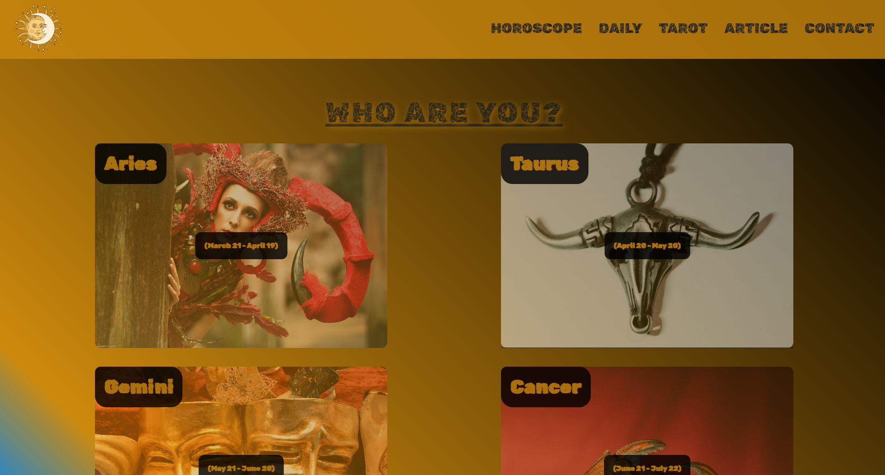

## Horoscope Page Project

## Description
This project aims to design a simple astrology onboarding page with React.

## Objective
Technologies used in the project;

* HTML
* CSS / SCSS / SASS
* JavaScript
* React
* React Deployment

-----

### Project Skeleton:

```
    Horoscope_Proect_Sass(folder)
    |
    |---- public
            |---- index.html
    |---- src
            |---- compenents
                    |---- header
                            |---- Header.jsx
                            |---- Header.scss
                    |---- helpers
                            |---- data.js
                            |---- logo.png
                    |---- main
                            |---- Card.jsx
                            |---- Main.jsx
                            |---- Main.scss
                    |---- navbar
                            |---- Navbar.jsx
                            |---- Navbar.scss
                    |---- scss
                            |---- _mixins.scss
                            |---- _reset.scss
                            |---- _variables.scss
            |---- App.js
            |---- App.scss
            |---- deploy_info.png
            |---- index.js                                   
            |---- project_view.png
    |---- .gitignore
    |---- README.md
    |---- package-lock.json
    |---- package.json
    |---- yarn.lock
```

### Project View Images:



> Designed By DOGUKAN © Apr. 2024